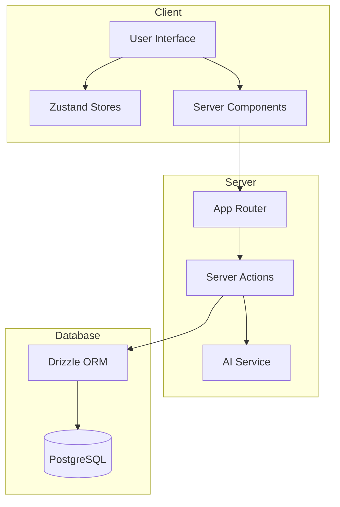
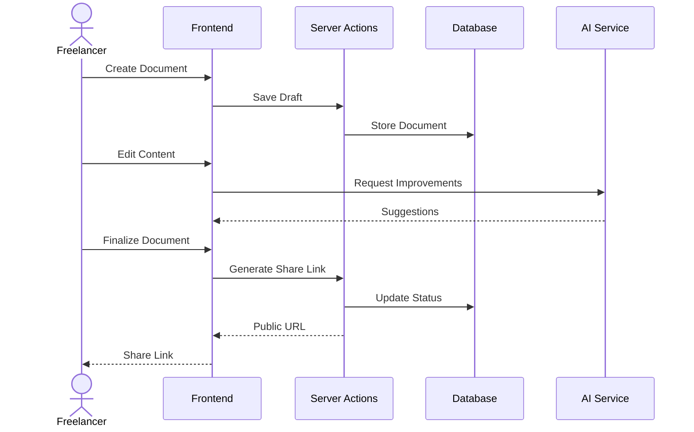
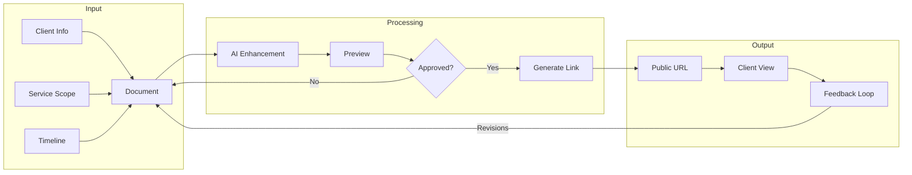

# 📄 Dokazi - AI-Powered Freelancer Proposal Crafter

[](https://nextjs.org/)
[](https://www.typescriptlang.org/)
[](https://tailwindcss.com/)
[](LICENSE)

## 🚀 Project Overview

- Dokazi is a smart document creation platform built specifically for freelancers.
- It empowers independent professionals to craft professional client-facing documents with ease, leveraging AI to improve content quality.
- With one click, freelancers can generate shareable public links to their documents, streamlining client communication and proposal delivery.

### Key Features

- **AI-Powered Document Creation**: Smart suggestions and improvements for your professional documents
- **One-Click Sharing**: Instantly generate public links for client-ready documents
- **Professional Templates**: Pre-built templates for proposals, contracts, and scope documents
- **Service Scope Builder**: Interactive tools to define and present your service offerings
- **Timeline & Milestone Planning**: Comprehensive breakdown of project timelines and milestones for clear client communication
- **Dark Mode Support**: Eye-friendly interface for long document editing sessions

## 🏗 Technical Architecture

### System Architecture Diagram



### User Flow



### Frontend Stack

- **Next.js 14**: App Router with Server Components for optimal performance
- **TypeScript**: Full type safety across the entire codebase
- **Tailwind CSS & Shadcn/ui**: Modern, responsive UI components
- **Zustand**: Efficient state management with separate stores for documents and user data
- **Drizzle ORM**: Type-safe database queries and schema management

### Key Technical Features

- **Authentication**: Secure user authentication and authorization
- **Document Management**: Complete CRUD operations with real-time updates
- **AI Integration**: Smart document enhancement using AI models
- **Credits System**: Built-in credit management for premium features
- **Public Sharing**: Secure document sharing with public links
- **Dark Mode**: System-aware theme switching

### Document Creation Workflow



### Performance Optimizations

- **Server Components**: Reduced client-side JavaScript
- **Dynamic Imports**: Optimized code splitting for faster loading
- **Edge Functions**: Fast, globally distributed API routes
- **Optimized Assets**: Next.js Image and Font optimization
- **State Management**: Efficient Zustand stores with persistence

## 🛠 Getting Started

1. **Clone the repository**

   ```bash
   git clone https://github.com/preston176/dokazi-app.git
   cd dokazi-app
   ```

2. **Install dependencies**

   ```bash
   bun install
   ```

3. **Set up environment variables**

   ```bash
   cp .env.example .env.local
   ```

4. **Run the development server**

   ```bash
   bun dev
   ```

   Open [http://localhost:3000](http://localhost:3000) to view the application.

## 📁 Project Structure

```typescript
dokazi/
├── app/                              # Next.js app directory
│   ├── (landingpage)/               # Landing page routes
│   │   └── page.tsx
│   ├── actions/                     # Server actions
│   │   ├── createOrGetUser.ts      # User management
│   │   ├── deductUserCredit.ts     # Credits system
│   │   ├── deleteDocument.ts       # Document operations
│   │   ├── fetchDocument.ts
│   │   ├── getAllUserDocuments.ts
│   │   ├── getUserDetails.ts
│   │   ├── saveDocument.ts
│   │   └── updateDocument.ts
│   ├── dashboard/                   # Main dashboard
│   │   ├── create-document/        # Document creation
│   │   │   ├── [docId]/           # Dynamic document routes
│   │   │   │   ├── _components/   # Document editor components
│   │   │   │   └── page.tsx
│   │   │   └── preview/           # Document preview
│   │   ├── entry-point/          # User entry flows
│   │   └── _components/          # Dashboard components
│   ├── document/                 # Document management
│   │   ├── edit/                # Document editing
│   │   └── view/                # Public document viewing
│   └── sign-in/                 # Authentication
├── components/                  # Shared components
│   ├── ui/                     # UI component library
│   │   ├── button.tsx
│   │   ├── card.tsx
│   │   ├── input.tsx
│   │   ├── select.tsx
│   │   └── textarea.tsx
│   ├── dark-mode-toggle.tsx
│   └── theme-provider.tsx
├── lib/                        # Utility functions
│   ├── deleteLocalDraft.ts
│   ├── genAIModel.ts          # AI integration
│   ├── useDocumentField.ts    # Custom hooks
│   └── utils.ts
├── store/                     # State management
│   ├── DocumentStore.ts       # Document state
│   ├── EditDocumentStore.ts   # Document editing state
│   └── UserStore.ts          # User state
├── src/                       # Core source
│   └── db/                   # Database
│       └── schema.ts        # Database schema
└── public/                   # Static assets
    ├── file.svg
    └── globe.svg

Configuration:
├── next.config.ts           # Next.js config
├── middleware.ts            # Auth & routing middleware
├── drizzle.config.ts       # Database config
└── components.json         # UI components config
```

## 🧪 Quality Assurance

- **TypeScript**: Strict type checking
- **ESLint**: Code quality enforcement
- **Prettier**: Code formatting
- **Husky**: Pre-commit hooks
- **Jest & Testing Library**: Unit and integration testing

## 🤝 Contributing

1. Fork the repository
2. Create your feature branch (`git checkout -b feature/AmazingFeature`)
3. Commit your changes (`git commit -m 'Add some AmazingFeature'`)
4. Push to the branch (`git push origin feature/AmazingFeature`)
5. Open a Pull Request

## 📈 Future Roadmap

- [ ] Subscription management for premium features
- [ ] Advanced AI writing assistant for professional tone and clarity
- [ ] Automated pricing suggestions based on scope
- [ ] Client feedback and revision tracking system
- [ ] Signature integration for contracts
- [ ] Analytics dashboard for proposal success rates

## 📜 License

This project is licensed under the MIT License - see the [LICENSE](LICENSE) file for details.

## 🌟 Why This Project Stands Out

1. **Freelancer-First Design**: Built specifically for the needs of independent professionals
2. **AI-Enhanced Writing**: Smart suggestions help craft more professional documents
3. **Instant Sharing**: One-click public links generation for client access
4. **Modern & Fast**: Built with Next.js 15 for optimal performance

## 🔗 Connect With Me

- **Portfolio**: [Preston Mayieka](https://preston176.vercel.app/)
- **LinkedIn**: [Preston Mayieka](https://www.linkedin.com/in/preston-mayieka/)

---

Built with ❤️ by Preston
